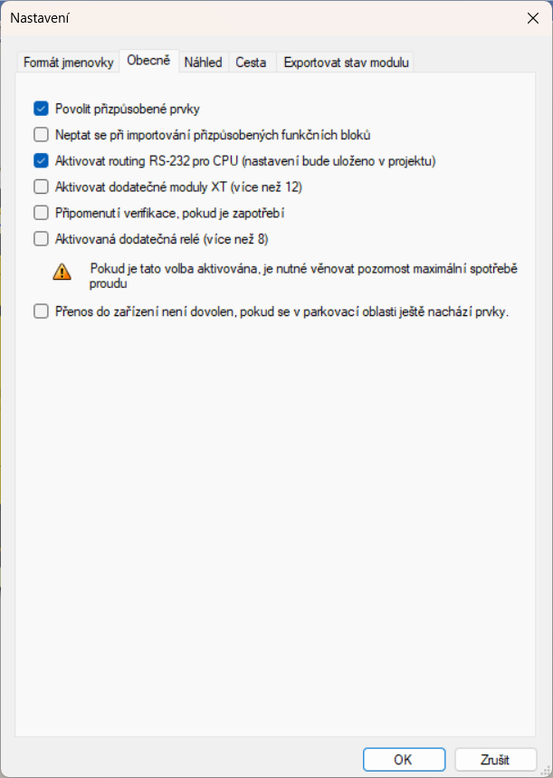
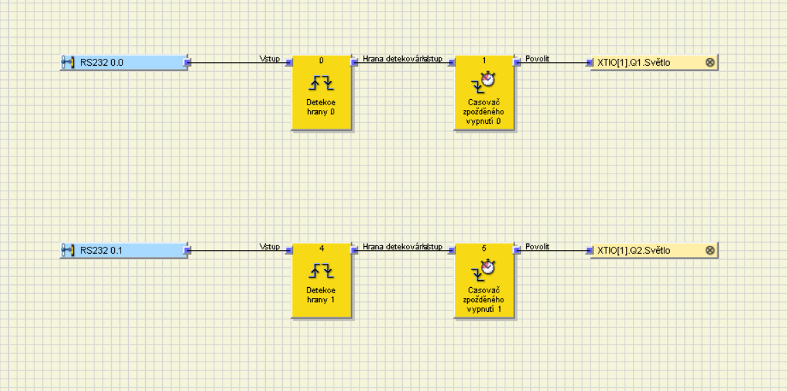

# FlexiSoft Runtime — Handbuch für Integration und Service

Dieses Handbuch ergänzt das README und beschreibt die praktische Einrichtung von FlexiSoft Runtime. Es richtet sich vor allem an die Integration in eine bestehende Maschine, die Anpassung der Konfiguration, die Vorbereitung von Meldungstexten und die grundlegende Diagnose.

FlexiSoft Runtime ist eine Bedien- und Service-Anwendung. Sie ist kein Bestandteil der Sicherheitsfunktion der Maschine. Die sichere Auswertung und der Reset der Sicherheitslogik müssen immer durch das Flexi-Soft-Projekt und die Verdrahtung der Maschine sichergestellt werden.

---

## 1. Prinzip

Die Runtime liest zyklisch Statusbits aus Flexi Soft über RK512. Aus diesen Bits wertet sie die überwachten Kanäle aus und zeigt der Bedienung entsprechend deren Zustand Meldungen an.

Wenn die Bedienung nach der Prüfung den Reset bestätigt, schreibt die Runtime das konfigurierte RS-232-Command-Bit. Das Flexi-Soft-Projekt erzeugt aus diesem Bit einen kurzen Reset-Impuls.

Grundablauf:

```text
FlexiSoftRuntime.exe
    -> RK512
    -> RS-232 oder TCP/RS-232-Wandler
    -> Flexi Soft CPU
    -> Projektlogik
    -> Reset-Relais / Ausgang
```

---

## 2. Wichtige Dateien

| Datei / Ordner | Bedeutung |
| --- | --- |
| `conf/config.json` | Hauptkonfiguration der Runtime: Kommunikation, Kanäle, Ausgänge, Meldungstexte, Logging. |
| `conf/languages.json` | UI-Übersetzungen, Sprachnamen und optionale Schriftarten. |
| `conf/runtime_state.json` | Letzte Runtime-Auswahl des Benutzers, zum Beispiel die zuletzt gewählte Sprache. |
| `docs/` | Lokalisierte Dokumentation. |
| `docs/assets/` | Bilder, die in der Dokumentation verwendet werden. |
| `fonts/` | Optionale Schriftarten. |
| `flexi_runtime.log` | Service-Log der Anwendung selbst. |

Die Metadaten des About-Fensters liegen nicht in einer separaten Runtime-Datei. Produktname, Version, lokalisierte Beschreibungen (EN/CZ/UK/FR/DE), Build-Datum, Build-Typ, Toolset und Zielsystem werden beim Build aus `src/about.h` in `FlexiSoftRuntime.exe` einkompiliert. Änderungen erfordern deshalb einen neuen Build; ein Neuladen der Konfiguration ändert die About-Daten nicht.

Für eine manuelle Bereitstellung ist daher keine separate Datei mit Versionsmetadaten erforderlich. Die Grundstruktur ist:

```text
FlexiSoftRuntime.exe
FlexiSoftMdReader.exe          # empfohlener Dokumentations-Viewer
conf/
  config.json
  languages.json
  runtime_state.json          # optional; wird bei Bedarf von der Runtime erstellt/aktualisiert
docs/
fonts/                        # optional; nur bei Verwendung einer Schriftdatei erforderlich
```

Die normale Bedienung bearbeitet diese Dateien nicht.

---

## 3. Konfiguration `conf/config.json`

`conf/config.json` ist die Hauptkonfiguration der Maschine. Empfohlenes Format ist UTF-8.

JSON-Zeichenketten können direkt als UTF-8 oder mit `\uXXXX`-Escapes geschrieben werden. Gültige UTF-16-Surrogate-Paare werden unterstützt. Für Konfigurations- und Sprachdateien bleibt direktes UTF-8 das bevorzugte Format.

Grundstruktur:

```json
{
  "language": "",
  "transport": "",
  "serial": {},
  "network": {},
  "rk512": {},
  "poll": {},
  "inputs": [],
  "ui": {},
  "logging": {},
  "debug": {}
}
```

### 3.1 `language`

```json
"language": "cz"
```

Standardsprache der Anwendung. Sie wird beim ersten Start verwendet oder wenn keine Runtime-Sprache gespeichert ist.

Empfehlungen:

- Basis-Fallback ist `en`,
- Tschechisch verwendet `cz`,
- Ukrainisch verwendet `uk`,
- weitere Sprachen können in `conf/languages.json` ergänzt werden.

Eine Sprachänderung zur Laufzeit überschreibt `conf/config.json` nicht.

---

### 3.2 `transport`

```json
"transport": "network"
```

Legt die Kommunikationsart fest.

| Wert | Bedeutung |
| --- | --- |
| `serial` | Direkter COM/RS-232-Port. |
| `network` | Netzwerktransport über TCP oder UDP. |

Für die Integration in ein Maschinen-OP/PC ist typischerweise `network` mit einem Ethernet/RS-232-Wandler geeignet.

---

## 4. Serielle Kommunikation `serial`

Der Abschnitt `serial` wird verwendet bei:

```json
"transport": "serial"
```

Beispiel:

```json
"serial": {
  "port": "COM5",
  "baud": 115200,
  "data_bits": 8,
  "parity": "N",
  "stop_bits": 1,
  "timeout_ms": 2500
}
```

| Parameter | Bedeutung |
| --- | --- |
| `port` | Name des COM-Ports, zum Beispiel `COM4` oder `COM5`. |
| `baud` | Geschwindigkeit der seriellen Schnittstelle. |
| `data_bits` | Anzahl der Datenbits. Üblicherweise `8`. |
| `parity` | Parität. Üblicherweise `N`. |
| `stop_bits` | Anzahl der Stoppbits. Üblicherweise `1`. |
| `timeout_ms` | Timeout für Lesen und Schreiben auf der seriellen Schnittstelle. |

Für Flexi Soft in diesem Projekt wird üblicherweise verwendet:

```text
115200 8N1
```

---

## 5. Netzwerkkommunikation `network`

Der Abschnitt `network` wird verwendet bei:

```json
"transport": "network"
```

Beispiel:

```json
"network": {
  "mode": "tcp_client",
  "host": "192.168.0.7",
  "port": 4001,
  "bind_host": "0.0.0.0",
  "bind_port": 0,
  "connect_timeout_ms": 3000,
  "timeout_ms": 1500
}
```

| Parameter | Bedeutung |
| --- | --- |
| `mode` | Netzwerk-Transportmodus. |
| `host` | IP-Adresse oder Hostname des Wandlers. |
| `port` | TCP/UDP-Port des Wandlers. |
| `bind_host` | Lokale Adresse für UDP-Bind. Im TCP-Client-Modus normalerweise nicht zu ändern. |
| `bind_port` | Lokaler Port für UDP-Bind. `0` bedeutet automatisch. |
| `connect_timeout_ms` | Timeout für den Aufbau einer TCP-Verbindung. |
| `timeout_ms` | Timeout für das Lesen einer Antwort. |

Unterstützte Werte für `mode`:

| Wert | Bedeutung |
| --- | --- |
| `tcp_client` | Die Runtime verbindet sich als TCP-Client mit einem Ethernet/RS-232-Wandler. Empfohlener Modus. |
| `udp` | UDP-Modus. Nur verwenden, wenn es zum konkreten Wandler passt und getestet ist. |

Praktischer Einsatz an der Maschine:

```text
Maschinen-OP/PC mit Runtime
    -> bestehendes Maschinen-Ethernet
    -> Ethernet/RS-232-Wandler
    -> RS-232 Flexi Soft CPU
```

So muss keine separate lange RS-232-Leitung zwischen Maschinen-OP und Schaltschrank verlegt werden.

---

## 6. RK512 `rk512`

Beispiel:

```json
"rk512": {
  "device_local": "0x4F",
  "device_reply": "0x4D",
  "token_hex": "0F 0F 46 4C 58 54 30 31"
}
```

| Parameter | Bedeutung |
| --- | --- |
| `device_local` | Lokale RK512-Adresse der Runtime-Anwendung. |
| `device_reply` | Erwartete RK512-Antwortadresse von Flexi Soft. |
| `token_hex` | Token, das vor dem Schreiben eines Commands verwendet wird. |

In der Konfiguration `token_hex` verwenden.

Die Werte müssen zur geprüften RK512-Kommunikation des konkreten Projekts passen.

---

## 7. Polling `poll`

Beispiel:

```json
"poll": {
  "period_ms": 1000,
  "read_block": "0x76",
  "read_size": 54
}
```

| Parameter | Bedeutung |
| --- | --- |
| `period_ms` | Periode zum Lesen des Statusblocks. |
| `read_block` | RK512-Block, aus dem die Zustände gelesen werden. |
| `read_size` | Anzahl der gelesenen Bytes. |

Aus dem gelesenen Block wertet die Runtime Kanäle anhand von `status_byte`, `on_bit` und `ok_bit` aus.

---

## 8. Kanäle `inputs`

Die Runtime unterstützt bis zu vier Kanäle. Jeder Kanal ist ein Eintrag im Array `inputs`.

Beispiel:

```json
{
  "enabled": true,
  "name": "Schutzhaube linke Seite",
  "status_byte": 0,
  "on_bit": 0,
  "ok_bit": 1,
  "alert_text_de": "Prüfe, ob die linke Seite der Schutzhaube vollständig geschlossen ist.",
  "output": {
    "block": "0x42",
    "byte": 0,
    "bit": 0,
    "pulse_ms": 1000
  },
  "repeat_fault": {
    "count": 3,
    "window_ms": 30000,
    "ignore_after_command_ms": 1500,
    "text_de": "Der Fehler kehrt wiederholt zurück. Prüfe die linke Schutzhaube und den Sensor."
  }
}
```

### 8.1 Grundparameter des Kanals

| Parameter | Bedeutung |
| --- | --- |
| `enabled` | Aktiviert/deaktiviert den Kanal. Ein deaktivierter Kanal wird nicht überwacht und zeigt keine Meldungen. |
| `name` | Kanalname, der im Tray-Menü und in Meldungen angezeigt wird. |
| `status_byte` | Byte-Index im gelesenen Statusblock. |
| `on_bit` | Informatives ON/OFF-Bit des Kanals. |
| `ok_bit` | Bit, anhand dessen die Runtime entscheidet, ob der Kanal in Ordnung ist. |
| `alert_text_<Sprache>` | Text der normalen Meldung für die jeweilige Sprache. |

Der ältere Schlüssel `alert_text` kann als Fallback dienen, empfohlen sind aber sprachspezifische Schlüssel:

```text
alert_text_en
alert_text_cz
alert_text_uk
alert_text_fr
alert_text_de
```

Wenn die aktive Sprache keinen Text enthält, verwendet die Runtime Englisch oder einen Fallback-Text.

### 8.2 Ausgangs-Command `output`

```json
"output": {
  "block": "0x42",
  "byte": 0,
  "bit": 0,
  "pulse_ms": 1000
}
```

| Parameter | Bedeutung |
| --- | --- |
| `block` | RK512-Block zum Schreiben des Commands. |
| `byte` | Byte in den geschriebenen Daten. |
| `bit` | Bit in diesem Byte. |
| `pulse_ms` | Zeit, für die die Runtime das Command-Bit hält. |

Bei einem Command setzt die Runtime das Bit, wartet `pulse_ms` und löscht das Bit danach wieder.

Wichtig: Auch wenn die Runtime das Bit nur begrenzt hält, muss ein kurzer Reset-Impuls zusätzlich in der Flexi-Soft-Logik erzeugt werden. Dadurch wird eine dauerhafte Wirkung bei Kommunikations- oder Anwendungsausfall verhindert.

---

## 9. Wiederholte Meldung `repeat_fault`

Repeat fault behandelt die Situation, in der derselbe Fehler nach einem Reset-Impuls wiederholt zurückkehrt.

Beispiel:

```json
"repeat_fault": {
  "count": 3,
  "window_ms": 30000,
  "ignore_after_command_ms": 1500,
  "text_de": "Prüfe, ob die Schutzhaube vollständig geschlossen ist."
}
```

| Parameter | Bedeutung |
| --- | --- |
| `count` | Wie oft der Fehler im aktiven Zeitfenster zurückkehren darf, bevor eine wiederholte Meldung entsteht. Minimum ist `1`. |
| `window_ms` | Zeitfenster zum Zählen wiederholter Fehlerrückkehr. Minimum ist `1000 ms`. |
| `ignore_after_command_ms` | Schutzzeit nach dem Reset-Command. Während dieser Zeit ignoriert die Runtime den transienten Eingangszustand, der durch den Hardware-Reset über Relais entsteht. Negative Werte werden als `0` behandelt. |
| `text_<Sprache>` | Text der wiederholten Meldung für die jeweilige Sprache. |

Empfohlene Sprachschlüssel:

```text
text_en
text_cz
text_uk
text_fr
text_de
```

### 9.1 Wie die Wiederholung gezählt wird

Nach der Reset-Bestätigung sendet die Runtime den Reset-Command und startet die Schutzzeit `ignore_after_command_ms`.

Diese Zeit ist nicht hauptsächlich dafür gedacht, die „Rückkehr desselben Fehlers nicht zu melden“. Ihr eigentlicher Zweck ist, den transienten Eingangszustand während des Hardware-Resets herauszufiltern.

Beim Reset werden die überwachten Eingangskanäle kurz über Relais geöffnet. In diesem Zustand können beide Eingangskanäle AUS sein, und Flexi Soft beginnt seine Zeit für die Kanalsimultanität erneut zu zählen. Aus Sicht der Runtime kann der Eingang daher kurz wie OK aussehen, obwohl es nur ein durch den Reset verursachter Übergangszustand ist.

Wenn die Runtime diesen kurzen Zustand als echtes OK werten würde, würde sie die Logik der wiederholten Meldung fälschlich zurücksetzen. Deshalb darf der Übergangszustand während `ignore_after_command_ms` die Repeat-Logik nicht beeinflussen.

Während `ignore_after_command_ms` gilt:

- ein kurzes OK wird nicht als echte Reparatur des Eingangs betrachtet,
- der Wiederholungszähler wird nicht zurückgesetzt,
- der Übergangszustand wird nicht als neue Fehlerrückkehr gezählt,
- es wird keine neue Meldung aufgrund des Übergangszustands geöffnet.

Nach Ablauf von `ignore_after_command_ms` wertet die Runtime den tatsächlichen Kanalzustand wieder aus:

- wenn der Kanal weiterhin im Fehler ist, wird der Wiederholungszähler erhöht,
- wenn der Kanal nach Ablauf der Schutzzeit wirklich in Ordnung ist, wird der Wiederholungszähler zurückgesetzt,
- wenn der Zähler `count` erreicht, wird die wiederholte Meldung angezeigt.

Die Wartezeit der Bedienung vor der Bestätigung wird in `window_ms` eingerechnet. Die Command-Dauer, die Impulsdauer und die Schutzzeit `ignore_after_command_ms` werden nicht in das aktive Fenster eingerechnet.

### 9.2 Aktive Fehler und Repeat-Limit

Die Wiederholungszähler werden für jeden überwachten Kanal getrennt geführt. Intern sind die aktuell aktiven Fehler (`errorMask`) und die Kanäle, die bereits das Repeat-Limit erreicht haben (`repeatMask`), getrennt. Ein Repeat-Alert kann daher alle aktuell aktiven Fehler auflisten, während der korrigierende Repeat-Text nur für Kanäle in `repeatMask` angezeigt wird.

---

## 10. UI `ui`

Beispiel:

```json
"ui": {
  "tray_tooltip": "FlexiSoft RS232 Runtime",
  "tray_tooltip_en": "FlexiSoft RS232 Runtime",
  "tray_tooltip_cz": "FlexiSoft RS232 Runtime",
  "tray_tooltip_uk": "FlexiSoft RS232 Runtime",
  "tray_tooltip_fr": "FlexiSoft RS232 Runtime",
  "tray_tooltip_de": "FlexiSoft RS232 Runtime"
}
```

| Parameter | Bedeutung |
| --- | --- |
| `tray_tooltip` | Fallback-Text des Tray-Tooltips. |
| `tray_tooltip_<Sprache>` | Lokalisierter Tooltip für eine bestimmte Sprache. |

`tray_tooltip` bleibt als Legacy-Fallback erhalten. In aktuellen Konfigurationen sollten die sprachspezifischen Schlüssel `tray_tooltip_<Sprache>` verwendet werden.

Empfohlen werden sprachspezifische Schlüssel:

```text
tray_tooltip_en
tray_tooltip_cz
tray_tooltip_uk
tray_tooltip_fr
tray_tooltip_de
```

---

## 11. Logging `logging`

Beispiel:

```json
"logging": {
  "enabled": true,
  "file": "flexi_runtime.log",
  "newest_first": true,
  "max_bytes": 65536
}
```

| Parameter | Bedeutung |
| --- | --- |
| `enabled` | Logging ein-/ausschalten. |
| `file` | Pfad zur Logdatei. |
| `newest_first` | Wenn `true`, stehen die neuesten Zeilen oben. |
| `max_bytes` | Ungefähre maximale Loggröße. Minimum ist `4096`. |

Empfohlener Produktionsmodus:

```json
"newest_first": true
```

`newest_first=false` bleibt als Legacy-Modus verfügbar, wird für den Produktionseinsatz jedoch nicht empfohlen.

Das Log ist immer auf Englisch. Die UI-Sprache hat darauf keinen Einfluss.

---

## 12. Debug `debug`

Beispiel:

```json
"debug": {
  "force_command_fail": false
}
```

| Parameter | Bedeutung |
| --- | --- |
| `force_command_fail` | Testoption zum Erzwingen eines Command-Fehlers. Im Normalbetrieb muss sie `false` sein. |

Dieser Abschnitt dient nur Test und Diagnose.

---

## 13. Runtime-Zustand `conf/runtime_state.json`

`conf/runtime_state.json` speichert die letzte Runtime-Auswahl des Benutzers, aktuell hauptsächlich die Sprache.

Beispiel:

```json
{
  "language": "cz"
}
```

Wenn die Datei fehlt, wird die Sprache aus `conf/config.json` verwendet. Wenn die Datei beschädigt ist, schreibt die Runtime eine Warnung ins Log und verwendet die Sprache aus `conf/config.json`.

Eine Sprachänderung zur Laufzeit überschreibt `conf/config.json` nicht.

Wenn das Speichern von `runtime_state.json` fehlschlägt, schreibt die Runtime nur eine Warnung ins Log. Die bereits gewählte UI-Sprache bleibt aktiv und wird nicht zurückgesetzt.

---

## 14. Übersetzungen `conf/languages.json`

`conf/languages.json` enthält UI-Übersetzungen und optionale Schriftarteinstellungen.

Grundstruktur:

```json
{
  "languages": {
    "en": {
      "name": "",
      "font_face": "",
      "font_file": "",
      "strings": {}
    }
  }
}
```

### 14.1 `languages`

Das Objekt `languages` enthält die einzelnen Sprachen. Der Sprachschlüssel ist gleichzeitig der Sprachcode, zum Beispiel:

```text
en
cz
uk
fr
de
```

### 14.2 Sprachparameter

| Parameter | Bedeutung |
| --- | --- |
| `name` | Sprachname, der im Tray-Menü angezeigt wird. |
| `font_face` | Name einer Systemschrift oder Font Face. |
| `font_file` | Optionale Schriftdatei, relativ zum Anwendungsordner. |
| `strings` | UI-Übersetzungsschlüssel. |

Wenn `font_file` existiert und geladen werden kann, verwendet die Runtime diese Schrift. Andernfalls wird eine Fallback-Schrift verwendet. Das ist besonders wichtig für Sprachen, für die auf älteren Windows-Systemen möglicherweise keine geeignete Systemschrift vorhanden ist.

### 14.3 Fallback-Regeln für Übersetzungen

- Englisch (`en`) dient als Basis-Fallback.
- Wenn die aktive Sprache einen Text nicht enthält, wird der englische Text verwendet.
- Wenn der Text auch auf Englisch fehlt, wird der Schlüsselname angezeigt.
- Eine fehlende oder leere `conf/languages.json` kann von der Runtime durch eine einfache englische Vorlage ersetzt werden.

### 14.4 Wichtige Übersetzungsschlüssel

#### Tray-Menü

| Schlüssel | Bedeutung |
| --- | --- |
| `tray.title` | Titel des Tray-Menüs. |
| `tray.reload_config` | Eintrag zum Neuladen der Konfiguration. |
| `tray.reconnect` | Eintrag für Reconnect der Kommunikation. |
| `tray.about` | About-Eintrag. |
| `tray.exit` | Programm beenden. |
| `tray.language` | Sprach-Untermenü. |
| `tray.send_command` | Text des manuellen Commands; unterstützt den Token `{channel}`. |

#### Statustexte

| Schlüssel | Bedeutung |
| --- | --- |
| `status.ok` | Zustand OK. |
| `status.error` | Fehlerzustand. |
| `status.on` | Zustand ON. |
| `status.off` | Zustand OFF. |
| `status.disabled` | Deaktivierter Kanal. |

#### Meldungen

| Schlüssel | Bedeutung |
| --- | --- |
| `alert.input.window_title` | Fenstertitel der normalen Meldung. |
| `alert.repeat.window_title` | Fenstertitel der wiederholten Meldung. |
| `alert.command_failed.window_title` | Fenstertitel der Meldung bei fehlgeschlagenem Command. |
| `alert.input.title` | Überschrift der normalen Meldung. |
| `alert.repeat.title` | Überschrift der wiederholten Meldung. |
| `alert.command_failed.title` | Überschrift der Meldung bei fehlgeschlagenem Command. |
| `alert.repeat.prefix` | Einleitungstext der wiederholten Meldung. |
| `alert.active_errors` | Überschrift der Liste aktiver Fehler. |
| `alert.command_failed.text` | Text bei fehlgeschlagenem Command. |
| `alert.affected_channels` | Überschrift der Liste betroffener Kanäle. |
| `alert.input.footer_yes` | Erklärung der YES/JA-Schaltfläche bei einer normalen Meldung. |
| `alert.input.footer_no` | Erklärung der NO/NEIN-Schaltfläche bei einer normalen Meldung. |
| `alert.command_failed.footer_yes` | Erklärung von YES/JA bei fehlgeschlagenem Command. |
| `alert.command_failed.footer_no` | Erklärung von NO/NEIN bei fehlgeschlagenem Command. |

#### Schaltflächen

| Schlüssel | Bedeutung |
| --- | --- |
| `button.yes` | Text der Schaltfläche Ja / YES. |
| `button.no` | Text der Schaltfläche Nein / NO. |
| `button.ok` | Text der OK-Schaltfläche. |

#### About und Dokumentation

| Schlüssel | Bedeutung |
| --- | --- |
| `about.title` | Titel des About-Dialogs. |
| `about.version` | Versionsbeschriftung. |
| `about.build_date` | Beschriftung des Build-Datums. |
| `about.open_readme` | Schaltfläche zum Öffnen des README. |
| `about.open_manual` | Schaltfläche zum Öffnen des MANUAL. |
| `about.open_log` | Schaltfläche zum Öffnen des Logs. |
| `about.project_page` | Schaltfläche zur Projektseite. |
| `error.missing_readme` | Fehler bei fehlendem README. |
| `error.missing_manual` | Fehler bei fehlendem MANUAL. |
| `error.missing_log` | Fehler bei fehlendem Log. |

---

## 15. Weitere Sprache hinzufügen

Vorgehen:

1. In `languages.json` ein neues Sprachobjekt hinzufügen, zum Beispiel `pl`.
2. `name`, `font_face` und optional `font_file` ausfüllen.
3. Texte in `strings` ergänzen.
4. In `config.json` kann `"language": "pl"` gesetzt werden, oder die Sprache wird zur Laufzeit im Tray-Menü gewählt.
5. Für die Dokumentation passende Dateien hinzufügen, zum Beispiel:

```text
docs/README_pl.md
docs/MANUAL_pl.md
```

---

## 16. Dokumentation

Die Runtime öffnet die Dokumentation entsprechend der aktiven Sprache.

Basisdokumentation:

```text
docs/README.md
docs/MANUAL.md
```

Lokalisierte Dokumentation:

```text
docs/README_cz.md
docs/MANUAL_cz.md
docs/README_uk.md
docs/MANUAL_uk.md
docs/README_fr.md
docs/MANUAL_fr.md
docs/README_de.md
docs/MANUAL_de.md
```

Wenn die lokalisierte Datei fehlt, wird die Basisdatei ohne Sprachsuffix verwendet.

Die Dokumentation wird normalerweise mit dem externen `FlexiSoftMdReader.exe` geöffnet (v1.0.1 im aktuellen Runtime-Paket). Die Runtime übergibt dem Reader das ausgewählte Dokument und die effektive UI-Schrift. Reader v1.0.1 enthält Kompatibilitätsbehandlung für die unter Windows XP verwendete alte IE-Engine. Wenn der Reader nicht verwendet werden kann, fällt die Runtime auf Notepad und anschließend auf ShellExecute zurück. Der Reader unterstützt den in der mitgelieferten Dokumentation verwendeten Markdown-Subset einschließlich Bildern aus `docs/assets/`.

---

## 17. Einstellung in Flexi Soft Designer

### 17.1 RS-232-Routing

Im Projekt muss aktiviert sein:

```text
RS-232-Routing für CPU aktivieren
```



### 17.2 Kurzer Impuls in der CPU-Logik

Die Runtime schreibt das Command-Bit, aber der eigentliche kurze Impuls muss auch im Flexi-Soft-Projekt erzeugt werden.

Empfohlenes Prinzip:

```text
RS-232-Bit -> Flankenerkennung -> Timer / kurzer Impuls -> Reset-Relais oder Reset-Ausgang
```



Grund: Bei Kommunikations- oder Runtime-Ausfall dürfen überwachte Eingänge nicht dauerhaft getrennt bleiben und das Reset-Signal darf nicht dauerhaft aktiv bleiben.

---

## 18. Konfiguration neu laden

Die Konfiguration kann aus dem Tray-Menü neu geladen werden.

Neu geladen werden:

- `conf/config.json`,
- `conf/languages.json`,
- `conf/runtime_state.json`.

Die About-Metadaten sind in die EXE eingebettet und werden durch das Neuladen der Konfiguration nicht geändert.

Wenn eine Meldung geöffnet ist, schließt die Runtime sie. Wenn der Fehler weiterhin besteht, zeigt sie eine neue Meldung nach der aktuellen Konfiguration und den aktuellen Texten an.

Reconnect verwendet denselben Modeless-Alert-Ablauf: Die alte Meldung wird vor dem Reconnect geschlossen, und wenn der Fehler nach Wiederherstellung der Kommunikation weiterhin besteht, wird eine neue aktuelle Meldung angezeigt.

---

## 19. Tray-Symbol und Tray-Menü

Das Tray-Symbol zeigt den Gesamtzustand der Kommunikation und der Kanäle:

| Symbolzustand | Bedeutung |
| --- | --- |
| Grün | Kommunikation ist in Ordnung und kein überwachter Kanal ist im Fehler. |
| Rot | Kommunikation ist in Ordnung, aber mindestens ein überwachter Kanal ist im Fehler. |
| Gelb / neutral | Start, Reconnect oder Warten auf Zustandsbestätigung. |
| Grau / Kommunikationsfehler | Die Runtime hat keine gültige Verbindung zur Flexi-Soft-CPU. |

Das Tray-Menü zeigt den Zustand der aktivierten Kanäle CH1 bis CH4. Für jeden Kanal sind Name sowie ON/OFF- und OK/FEHLER-Zustand sichtbar.

Manuelle Commands sind nur verfügbar, wenn die Kommunikation mit der CPU gültig ist.

---

## 20. Logging und Diagnose

Das Log ist ein Service-Log der Anwendung, kein Produktions- oder Sicherheitslog der Maschine.

Es protokolliert zum Beispiel:

- Start der Anwendung,
- Laden der Konfiguration,
- Öffnen des Transports,
- Kommunikationsfehler,
- Wiederherstellung der Kommunikation,
- Anzeige einer Meldung,
- Command ON/OFF,
- Command-Fehler,
- wiederholte Meldung,
- Reconnect,
- Shutdown.

Bei einem dauerhaft gleichen Kommunikationsfehler begrenzt die Runtime das Überfluten des Logs. Derselbe Fehler wird nicht in jedem Zyklus protokolliert, solange sich Zustand oder Fehlertext nicht ändern.

---

## 21. Fehlersuche

### Runtime verbindet sich nicht

Prüfen:

- Transporttyp,
- IP-Adresse und Port des Wandlers,
- COM-Port,
- serielle Parameter,
- Verdrahtung,
- Versorgung des Wandlers,
- RS-232-Routing im Flexi-Soft-Projekt,
- RK512-Adressen.

### Wandler ist erreichbar, aber Flexi Soft antwortet nicht

Prüfen:

- ob die Flexi-Soft-CPU in RUN ist,
- ob die RS-232-Schnittstelle korrekt angeschlossen ist,
- ob die RK512-Einstellungen passen,
- ob gelesener Block und Größe passen,
- ob das Projekt die benötigten Signale enthält.

### Manueller Command ist ausgegraut

Die Runtime hat keine gültige Kommunikation mit der Flexi-Soft-CPU. Zuerst die Kommunikation wiederherstellen oder den Wandler prüfen.

### Meldung kehrt nach Reset zurück

Nach Ablauf der Schutzzeit ist der überwachte Eingang weiterhin im Fehler. Schutzhaube/Einhausung, Sensoren und Verdrahtung prüfen.

### Wiederholte Meldung

Der Fehler kehrt nach Reset wiederholt zurück. Die Bedienung darf nicht ohne physische Prüfung weiter bestätigen. Schutzhaube, Sensoren, Verdrahtung oder Sicherheitslogik müssen geprüft werden.

### Command fehlgeschlagen

Das Command-Bit konnte nicht geschrieben oder gelöscht werden. Kommunikation, RK512-Schreibblock, Token und RS-232-Routing prüfen.

---

## 22. Checkliste für die Übergabe

Vor der Übergabe prüfen:

- RS-232-Routing für die CPU ist aktiviert.
- RS-232-Command-Bits sind in der Flexi-Soft-Logik eingebunden.
- Der Reset-Impuls wird in Flexi Soft als kurzer Impuls erzeugt.
- Die Kommunikation entspricht der Einstellung in `config.json`.
- Gelesener Block und Größe entsprechen dem Projekt.
- Statusbytes und Bits entsprechen dem Projekt.
- Output-Command-Bits entsprechen dem Projekt.
- Meldungstexte sind für die Bedienung verständlich.
- Die wiederholte Meldung sagt klar, wann Instandhaltung zu rufen ist.
- `ignore_after_command_ms` überbrückt nur den transienten Hardware-Reset der Eingänge und setzt die Repeat-Logik nicht durch einen falschen OK-Zustand zurück.
- Tray-Symbol und Tray-Menü entsprechen dem realen Zustand.
- Das Neuladen der Konfiguration lädt auch geänderte Sprachen.
- Das Log ist lesbar.

---

## Autor

```text
KVLab - Vladimír Kopal
vladakopal@gmail.com
```
